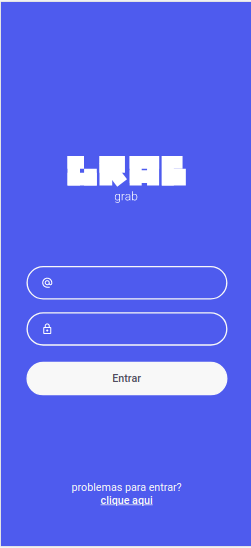
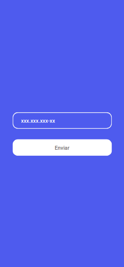
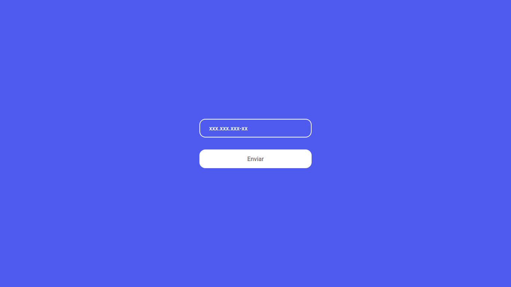

<h2 align="center">Pequenos Projetos</h2>
<h3 align="center">Projetos feitos durante estudos de HTML, CSS e JS.</h3>

 <a href="#grab-login">Grab Login</a> •
 <a href="#validador-de-cpf">Validador de CPF</a> • 
 <a href="#timer">Timer</a> • 
 <a href="#lista-de-tarefas">Lista de Tarefas</a> • 
 <a href="#imc">IMC</a>

# Grab Login
- O Grab login, é um desafio da <a href="https://www.devchallenge.com.br/challenges?type=frontend">DevChallenge</a>, com objetivo de criar um layout idêntico ao fornecido, também é proposto fazer uma validação do email fornecido pelo usuário.

- O site foi desenvolvido com o método mobile first e depois foi sendo adaptado para diferentes tamanhos de telas.

<h4 align="center"> 
	🚧 Em construção...  🚧
</h4>

# Validador de CPF
- Para esse problema, foi utilizado o algoritmo do governo para fazer a validação <a href="https://dicasdeprogramacao.com.br/algoritmo-para-validar-cpf/">saiba mais</a>.

- O site foi desenvolvido com o método mobile first e depois foi sendo adaptado para diferentes tamanhos de telas.

<h4 align="center"> 
	🚧 Em construção...  🚧
</h4>

# Timer
- O timer foi feito durante durante um curso na Udemy, o projeto trabalha com o objeto Date.

- Foram feitas algumas alterações do projeto original feito pelo instrutor, foi feito uma melhor organização dos botões e também adicionado animações. O site não é responsivo.

# Lista de Tarefas
- O clássico app para fazer uma lista de afazeres. Esse pequeno projeto foi feito durante um curso da Udemy.

- O intuito principal desse projeto, foi aprofundar no conceito de eventos no JS. Também o aplicativo tem a capacidade de tratar o armazenamento de dados no lado do cliente com o "localStorage", ou seja, guardar no navegador dados do cliente, como uma forma de ter uma segurança para não os perder em uma futura visita.

# IMC
- Site desenvolvido durante curso da Udemy para calcular o IMC de uma pessoa.

- Além de calcular o IMC, o programa faz a validação dos dados, para ver se foi inserido realmente números em ambos os campos.

